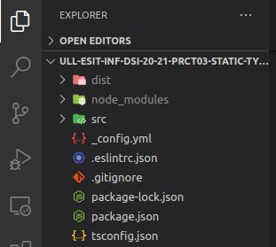
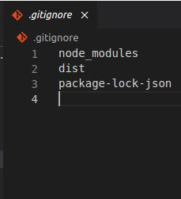
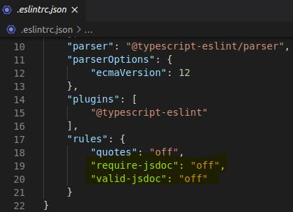
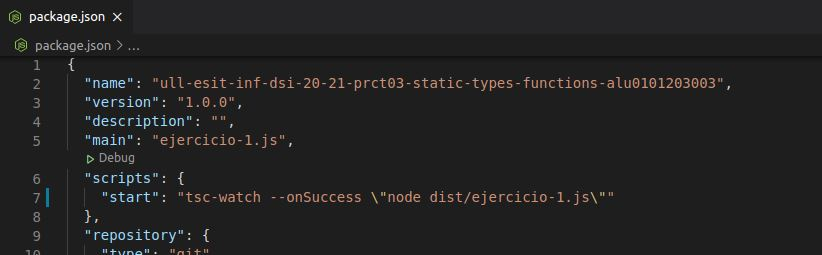

# Práctica 3: Tipos de datos estáticos y funciones. Informe.
## Desarrollo de Sistemas Informáticos 
## Raúl Martín Rigor - alu0101203003@ull.edu.es

### Introducción

En este informe se resumen las actividades realizadas en la **práctica 3** para poner en práctica nuestros conocimientos de TypeScript sobre cadenas de texto (*string*) a través de la implementación de distintas funciones en una serie de ejercicios.

### Objetivos

Al finalizar la práctica, habremos completado los siguientes objetivos:

* Adquirir conocimientos sobre manejo, operacion y manipulación de *strings* en TypeScript
* Saber operar con digitos extraidos de una cadena de texto
* Manejar y hacer uso de expresiones regulares como patron de búsqueda/reemplazo
* Usar funciones anonimas para reducir el número de líneas de código de nuestro programa

### 1. Creación y configuración del driectorio del proyecto.

#### 1.1. Estructura inicial

Con el fin de preparar una estructura adecuada para nuestro proyecto seguiremos la [Guía de creación de un proyecto inicial](https://ull-esit-inf-dsi-2021.github.io/typescript-theory/typescript-project-setup.html).

Si hemos seguido los pasos correctamente acabaremos con una estructura como la siguiente:

  

En resumidas cuentas tendremos el directorio src donde se almacena el código fuente de cada ejercicio que realizaremos y el directorio dist contendrá el código resultante de compilarlos que será ejecutado. Además se encuentran todos los archivos de congiguración (para más detalle sobre el contenido de cada uno se recomienda consultar la [guía](https://ull-esit-inf-dsi-2021.github.io/typescript-theory/typescript-project-setup.html).

Crearemos tambien un fichero *.gitignore* y modificaremos el *.eslintcr.json* añadiéndole dos reglas que nos ignoren los errores propios de JavaScript ya que trabajaremos en TypeScript.

#### 1.2 Metodolgía de trabajo

La manera en la que trabajaremos será mediante el desarrollo de ejercicios en los que implementaremos funciones que nos permitan resolver los problemas planteados.

Para probar el funcionamiento de los ejercicios cambiaremos la propiedad start del fichero package.json y pondremos el nombre del ejercicio a probar. Ejecutaremos `npm start`:

 


### 2. Ejercicios

Paso a explicar la resolución de cada ejercicio y a adjuntar su código y salida. Se mostrará una versión simplificada de los enunciados de los ejercicios (para verlos al completo con aclaraciones y pistas, consultar la [guía de la práctica](https://ull-esit-inf-dsi-2021.github.io/prct03-types-functions/)

#### 1.1 Ejercicio 1

**Enunciado:**

Cree una función isLeapYear que devuelva si un año concreto es bisiesto o no. La función deberá recibir como parámetro el año a evaluar y devolverá verdadero o falso según corresponda.Tenga en cuenta que un año bisiesto ocurre en el calendario gregoriano:

* Cada año que es divisible por 4.
* Excepto cada año que es divisible por 100. 
* Al menos que el año también sea divisible por 400.

**Resolución:**

Tal y como está planteado el problema, existe dos casos en los que un año es bisiesto:

* Es divisible por 4 y no lo es por 100
* Es divisible por 100 pero también lo es por 4 y 400

Por lo tanto, si cumple una de las 2 condiciones devolverá true y si no false

```ts
function isLeapYear (year : number) {
    if(((year%4 == 0) && (year%100 != 0)) || ((year%4 == 0) && (year%100 == 0)&&(year%400 == 0))) {
       return true;
    }else {
        return false;
    }

}

console.log(isLeapYear(1997)); //false
console.log(isLeapYear(1996)); //true
```


#### 1.2 Ejercicio 2

**Enunciado:**

Codificar números decimales con factoriales es una forma de escribir números en un sistema base que depende de factoriales, en lugar de potencias.En este sistema, el último dígito siempre es 0 y está en base 0!. El dígito anterior pueder ser 0 o 1 y está en base 1!. Del mismo modo, el dígito anterior es 0, 1 o 2 y está en base 2!. De manera más general, el enésimo dígito respecto al último es siempre 0, 1, 2, ..., n y está en base n!.

Para resolver este ejercicio, defina dos funciones decimalToFactorial y factorialToDecimal. La primera, recibirá un entero positivo y devolverá como resultado una cadena de texto con la representación factorial del número recibido. Por el contrario, la función factorialToDecimal realizará la operación opuesta. Esto es, recibirá como paŕametro una cadena de texto en notación factorial y devolverá el número entero que representa.

**Resolución:**

Primero es necesario implementar una función `function factorial (n :number)` que nos permitirá sacar el factorial de un número. Nos será de utilidad para las dos funciones principales:

```ts

function factorial (n :number) { 
	if (n == 0){ 
		return 1; 
	}
	return n * factorial (n-1); 
}
```
Para pasar de decimal a factorial seguiremos un determinado protocolo:
* Buscaremos el factorial de mayor tamaño que, multiplicado por un entero, representa al numero de entrada sin pasarse
* Una vez encontrado el que se pasa del valor, le restamos uno para obtener el anterior ( `max_factorial--`)
* Buscamos ahora el entero por el que hay que multiplicarlo para acercarnos lo máximo posible y conservamos el resto para repetirle este proceso hasta que lleguemos al ultimo factorial de la base (0!)
```ts
function decimalToFactorial (n :number) {
    var codificado = "";
    var i :number = 0;
    var max_factorial :number = 0;
    while (i < 100) {
    max_factorial = i;
    var factorial_base = factorial(i);
        if (factorial_base > n){  //encontrar el factorial mayor que representa a n sin pasarse
            max_factorial--; //como se pasa se resta 1
            break;
        }
        else {
            i++;
        }
    }
    var resto = n;
    for(i = max_factorial; i > 0; i --) {
        var factorial_base = factorial(i); //factorial de la base
        var cociente = Math.floor(resto/factorial_base); //el valor por el que hay que multiplicar el factorial de la base (cociente truncado)
        resto = resto - factorial_base*cociente; //se actualiza el resto para la siguiente operación
        codificado = codificado+cociente; //se añade el valor al resultado
    }
    return codificado;

}
```
Para pasar de factorial a decimal multiplicaremos cada digito por el factorial que le corresponde hasta llegar a 0 (de atrás paraa alante). La suma de todos estos valores será el número en base decimal.

```ts

function factorialToDecimal (s :string) {
var sz: number = s.length;
var j :number = sz;
var num :number = 0;
for (var i :number = 0; i < sz; i++){
    var tmp :number = parseInt(s[i]);
    tmp = tmp * factorial(j);   //se multiplica cada digito por el factorial al que corresponde (j cuenta atrás)
    num = num + tmp;    //sumatorio de todas las multiplicaciones
    j--;
}
return num; //devuleve el numero sumado

}

console.log(decimalToFactorial(463));     //34101
console.log(factorialToDecimal("34101")); //463
```

#### 1.3 Ejercicio 3

**Enunciado:**

Supongamos que recibimos un mensaje en una cadena de texto que sigue un patrón “Xsubcadena1Ysubcadena2” dónde X e Y son números y subcadena1 y subcadena2 son cadenas de texto. Queremos comprobar la validez de un determinado mensaje en función de unas reglas preestablecidas. Para decidir si el mensaje es válido, debemos dividir la cadena de texto en números y subcadenas. Posteriormente, debemos comprobar que para cada número que encontramos, la longitud de la subcadena es igual al número anterior.

Defina una función isValid que reciba como parámetro una cadena de texto compuesta por números y letras y determine si es válida según las reglas anteriores. La función devolverá el resultado del cálculo mediante un valor de tipo booleano.

* Los mensajes solo tienen números y letras.
* Los números pueden tener varios dígitos. Por ejemplo, la cadena “4code10helloworld” es un mensaje válido.
* Cada número debe corresponder con la longitud de la subcadena que se encuentra a continuación, en cualquier otro caso el mensaje no será válido.
* La cadena vacía se considera un mensaje válido.

**Resolución:**

Para determinar si es valida, dividiremos la cadena en bloques que evaluaremos uno a uno hasta el final (`var bloque :string = s.slice(i,s.length);`). Obtendremos el tamaño del bloque de sus primeros 2 digitos (`bloque_sz`). Si un bloque no empieza indicando su longitud, la cadena perderá la validez (`if (isNaN(bloque_sz))`). A el tamaño se le sumará la cantidad de digitos de su tamaño para tenerlos en cuenta a la hora de avanzar en la cadena. 

Se recorrerá cada bloque de principio a fin contando las letras que tiene. Si este contador no coincide con el tamaño indicado del bloque, la cadena perderá la validez.

```ts
function isValid (s :string) {
    if (s == ""){  //si es la cadena vacía
        return true;
    }
    for(var i :number = 0; i < s.length; i++){
        var cont = 0;
        var bloque :string = s.slice(i,s.length);
        var bloque_sz :number = parseInt(bloque);
        if (isNaN(bloque_sz)){ //si el bloque no empieza por un numero que inidique su tamaño
            return false;
        }
        var digito :string = bloque_sz.toString();
        bloque_sz = bloque_sz + digito.length;
        for(var j :number = i+digito.length; j < i + bloque_sz; j++){ //se recorre el bloque de principio a fin (sin los digitos del tamaño)
            var pos :number = parseInt(s[j]);
            if (isNaN(pos) && j < s.length){ // se cuentan las letras
                cont++;
            }
        }
        i = i + bloque_sz - 1;
        if ((bloque_sz - digito.length) != cont){ // si el numero de letras no coincide con el tamaño del bloque: no es valido
            return false;
        }
    }
    return true;
}

console.log(isValid("3hey5hello2hi"));     // true
console.log(isValid("4code10helloworld")); // true
console.log(isValid("4code10heloworld"));  // false
console.log(isValid(""));                  // true
```


#### 1.4 Ejercicio 4

**Enunciado:**

A la hora de desarrollar código, hay diversas maneras de nombrar las variables, funciones, clases y otros elementos que componen el código. Un patrón muy usado en lenguajes de programación como Python es el Snake Case. Este patrón consiste en dividir los nombres de las variables y funciones usando guiones bajos entre palabras. Por ejemplo: sample_string o the_stealth_warrior.

Por el contrario, en lenguajes de programación como Java, C# y C/C++, predomina el denominado Camel Case. En este caso, los nombres de variables, clases y funciones se separan escribiendo con mayúscula la primera letra de la siguiente palabra. Siguiendo los ejemplos anteriores: sampleString o theStealthWarrior.

Desarrolle dos funciones fromSnakeToCamelCase y fromCamelToSnakeCase que conviertan una cadena de texto de un formato a otro. Ambas funciones recibirán como parámetro una cadena de texto y devolverán otra cadena con el nuevo formato. La primera función recibirá una cadena de texto en formato Snake Case y la convertirá a formato Camel Case. La segunda función realizará la operación contraria.

**Resolución:**

Para pasar de snake a camel case seguimos los siguientes pasos:

* Buscamos en la cadena de entrada todos los elementos formados por un guion bajo seguido de una minuscula
* Reemplazamos estos elementos por ellos mismos en mayúsculas (los guiones bajos permanecerán igual)
* Eliminamos los guiones bajos de la cadena
* 
```ts
function fromSnakeToCamelCase (s :string) {
    var result = "";
    var patron :RegExp = /[_][a-z]/g; //todos los elementos formados por un guion bajo seguido de una minuscula
    result = s.replace(patron,grupo => grupo.toUpperCase()); //reemplaza el grupo que coincide con el patron por el propio grupo en mayusculas
    result = result.replace(/[_]/g, ""); //se quitan los guiones bajos
    return result;
}

```
Para pasar de camel a snake case seguimos los siguientes pasos:

* Buscamos en la cadena de entrada todos los elementos seguidos de una mayúscula
* Dividimos la cadena en función de estos elementos y la volvemos a unir añadiendo un guión bajo
* Pasamos toda la cadena a minúsculas

```ts
function fromCamelToSnakeCase (s :string) {
    var result = "";
    var patron :RegExp = /(?=[A-Z])/g; //todos los elementos a los que le sigue una mayuscula
    result = s.split(patron).join("_"); //divide los elementos que cumplen con el patron y los une con guiones bajos
    result = result.toLowerCase(); // se pasa a minusculas
    return result;
}
```

```ts
console.log(fromSnakeToCamelCase("hola_mundo"));  //holaMundo
console.log(fromCamelToSnakeCase("holaMundo"));   //hola_mundo
```


#### 1.5 Ejercicio 5

**Enunciado:**

Chuck Norris es el tío más duro del mundo, una vez golpeó a un caballo en la barbilla y sus descendientes se conocen hoy en día como jirafas.

Como sus puñetazos, Chuck NUNCA necesita más de una línea de código. La tarea que debes realizar, para complacer a Chuck Norris, es crear una función que encadene 4 métodos en una única línea. Puedes utilizar varias líneas, pero no querrás cabrear a Chuck Norris.

Chuck espera como resultado una cadena de caracteres con sus cosas favoritas separadas, ordenadas, unidas de nuevo y, además, que se eliminen todas las apariciones de las letras e y a. Si alguien se atreve a retar a Chuck Norris con una cadena vacía la función devuelve “Broken!”.

Se espera un comportamiento como el siguiente:
* onePunch(‘Beard Jeans Hairbrush Knuckleduster Sand’) => ‘Brd Hirbrush Jns Knuckldustr Snd’
* onePunch(‘Sock Beard Vest Lady Sage’) =>’Brd Ldy Sg Sock Vst’
* onePunch(‘Beard Sack Gun Parachute Face-Kicking-Shoes’) =>’Brd Fc-Kicking-Shos Gun Prchut Sck’
* onePunch(‘Snot Snow Soda Tank Beard’) =>’Brd Snot Snow Sod Tnk’
* onePunch(‘’) =>’Broken!’

**Resolución:**


#### 1.6 Ejercicio 6

**Enunciado:**


**Resolución:**


#### 1.7 Ejercicio 7

**Enunciado:**


**Resolución:**


#### 1.8 Ejercicio 8

**Enunciado:**


**Resolución:**


#### 1.9 Ejercicio 9

**Enunciado:**


**Resolución:**


#### 1.10 Ejercicio 10

**Enunciado:**


**Resolución:**


