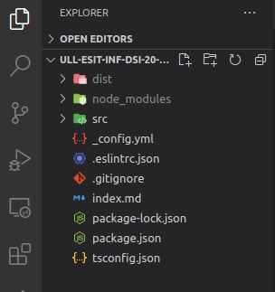

# Práctica 3: Tipos de datos estáticos y funciones. Informe.
## Desarrollo de Sistemas Informáticos 
## Raúl Martín Rigor - alu0101203003@ull.edu.es

### Introducción

En este informe se resumen las actividades realizadas en la **práctica 3** para poner en práctica nuestros conocimientos de TypeScript sobre cadenas de texto (*string*) a través de la implementación de distintas funciones en una serie de ejercicios.

### Objetivos

Al finalizar la práctica, habremos completado los siguientes objetivos:

* Adquirir conocimientos sobre manejo, operacion y manipulación de *strings* en TypeScript
* Saber operar con digitos extraidos de una cadena de texto
* Manejar y hacer uso de expresiones regulares como patron de búsqueda/reemplazo
* Usar funciones anonimas para reducir el número de líneas de código de nuestro programa

### 1. Creación y configuración del driectorio del proyecto.

#### 1.1. Estructura inicial

Con el fin de preparar una estructura adecuada para nuestro proyecto seguiremos la [Guía de creación de un proyecto inicial](https://ull-esit-inf-dsi-2021.github.io/typescript-theory/typescript-project-setup.html).

Si hemos seguido los pasos correctamente acabaremos con una estructura como la siguiente:

 

En resumidas cuentas tendremos el directorio src donde se almacena el código fuente de cada ejercicio que realizaremos y el directorio dist contendrá el código resultante de compilarlos que será ejecutado. Además se encuentran todos los archivos de congiguración (para más detalle sobre el contenido de cada uno se recomienda consultar la [guía](https://ull-esit-inf-dsi-2021.github.io/typescript-theory/typescript-project-setup.html).

#### 1.2 Metodolgía de trabajo

La manera en la que trabajaremos será mediante el desarrollo de ejercicios en los que implementaremos funciones que nos permitan resolver los problemas planteados.

Para probar el funcionamiento de los ejercicios cambiaremos la propiedad start del fichero package.json y pondremos el nombre del ejercicio a probar. Ejecutaremos `npm start`:

 

### 2. Ejercicios

Paso a explicar la resolución de cada ejercicio y a adjuntar su código y salida:

#### 1.1 Ejercicio 1

#### 1.2 Ejercicio 2

#### 1.3 Ejercicio 3

#### 1.4 Ejercicio 4

#### 1.5 Ejercicio 5

#### 1.6 Ejercicio 6

#### 1.7 Ejercicio 7

#### 1.8 Ejercicio 8

#### 1.9 Ejercicio 9

#### 1.10 Ejercicio 10
